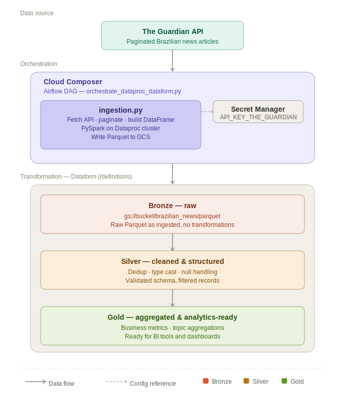

# Brazilian News Ingestion (Guardian API -> Dataproc -> GCS)

This project ingests Guardian news data, handles pagination, and writes Parquet files to GCS using PySpark on a Dataproc cluster.

## Data Architecture

The pipeline follows a **Medallion Architecture** (Bronze → Silver → Gold), orchestrated by Cloud Composer and powered by PySpark on Dataproc.



| Layer | Location | Description |
|-------|----------|-------------|
| **Source** | The Guardian API | Paginated news articles filtered for Brazil |
| **Orchestration** | Cloud Composer (Airflow) | DAG triggers `ingestion.py` on Dataproc; API key fetched from Secret Manager |
| **Bronze** | `gs://<bucket>/brazilian_news/parquet` | Raw Parquet files, as ingested — no transformations |
| **Silver** | Dataform (`/definitions`) | Deduplication, type casting, null handling, schema validation |
| **Gold** | Dataform (`/definitions`) | Aggregated business metrics and topic summaries, analytics-ready |

## 1. Structure

- Main code: `src/ingestion.py`
- API secret: Secret Manager
- Data destination: `gs://<bucket>/brazilian_news/parquet`

## 2. Prerequisites

- Active GCP project
- Enabled APIs:
  - Dataproc API
  - Secret Manager API
  - Cloud Storage API
- `gcloud` authenticated in Cloud Shell

## 3. Environment Variables (Cloud Shell)

Update the variables below to match your environment:

```bash
export PROJECT_ID="lc-qas-lake-house-0707"
export REGION="us-central1"
export CLUSTER="cluster-news"
export BUCKET="gcp-lc-datalakehouse-raw"
export SECRET_ID="API_KEY_THE_GUARDIAN"
gcloud config set project $PROJECT_ID
```

## 4. Create the API Secret in Secret Manager

```bash
echo -n "YOUR_GUARDIAN_API_KEY" | gcloud secrets create $SECRET_ID --data-file=-
```

If the secret already exists:

```bash
echo -n "YOUR_GUARDIAN_API_KEY" | gcloud secrets versions add $SECRET_ID --data-file=-
```

## 5. Minimum IAM Permissions for Dataproc

```bash
PROJECT_NUMBER=$(gcloud projects describe $PROJECT_ID --format='value(projectNumber)')
SA="${PROJECT_NUMBER}-compute@developer.gserviceaccount.com"
```

Allow secret read access:

```bash
gcloud secrets add-iam-policy-binding $SECRET_ID \
  --member="serviceAccount:${SA}" \
  --role="roles/secretmanager.secretAccessor"
```

Allow read/write access to the bucket:

```bash
gcloud storage buckets add-iam-policy-binding gs://$BUCKET \
  --member="serviceAccount:${SA}" \
  --role="roles/storage.objectAdmin"
```

Allow Dataproc worker role:

```bash
gcloud projects add-iam-policy-binding $PROJECT_ID \
  --member="serviceAccount:${SA}" \
  --role="roles/dataproc.worker"
```

## 6. Networking (if the cluster is private/internal IP only)

If you get `Network is unreachable` while installing pip packages during startup, create Cloud NAT:

```bash
gcloud compute routers create dp-router \
  --network=default \
  --region=$REGION

gcloud compute routers nats create dp-nat \
  --router=dp-router \
  --region=$REGION \
  --nat-all-subnet-ip-ranges \
  --auto-allocate-nat-external-ips
```

## 7. Create Dataproc Cluster (lightweight version)

```bash
gcloud dataproc clusters create $CLUSTER \
  --region=$REGION \
  --image-version=2.2 \
  --single-node \
  --master-machine-type=e2-standard-2 \
  --master-boot-disk-size=50GB \
  --properties='^#^dataproc:pip.packages=google-cloud-secret-manager==2.25.0,google-auth==2.38.0,python-dotenv==1.0.1,requests==2.32.3'
```

If the name already exists:

```bash
gcloud dataproc clusters delete $CLUSTER --region=$REGION -q
```

## 8. Upload Script to GCS

```bash
git clone your repo
```

```bash
gcloud storage cp src/ingestion.py gs://$BUCKET/jobs/ingestion.py
```

## 9. Submit PySpark Job

```bash
gcloud dataproc jobs submit pyspark gs://$BUCKET/jobs/ingestion.py \
  --cluster=$CLUSTER \
  --region=$REGION \
  --properties="spark.yarn.appMasterEnv.GOOGLE_CLOUD_PROJECT=$PROJECT_ID,spark.executorEnv.GOOGLE_CLOUD_PROJECT=$PROJECT_ID"
```

## 10. Validate Execution

List jobs:

```bash
gcloud dataproc jobs list --region=$REGION
```

Check details:

```bash
gcloud dataproc jobs wait <JOB_ID> --region=$REGION --project=$PROJECT_ID
```

Check output files:

```bash
gcloud storage ls gs://$BUCKET/brazilian_news/parquet
```

## 11. Quick Troubleshooting

- Error `Network is unreachable` during `pip install`
  - Cause: cluster has no internet egress.
  - Fix: create Cloud NAT.
- Error `DISKS_TOTAL_GB quota`
  - Cause: cluster is too large for your quota.
  - Fix: reduce disk/machine/workers (for example: `--single-node`, `50GB`).
- Error `ALREADY_EXISTS`
  - Cause: cluster name already in use.
  - Fix: delete old cluster or use a new name.

## 12. Clean Up Resources

```bash
gcloud dataproc clusters delete $CLUSTER --region=$REGION -q
```
